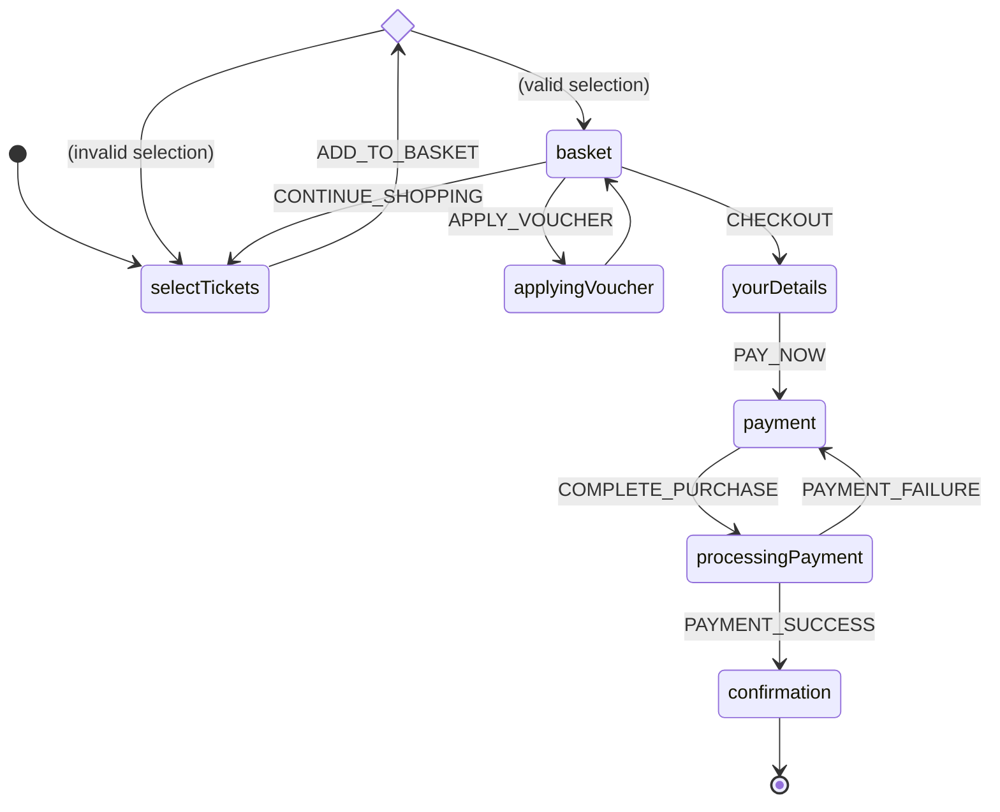

# Why state-machines?

## Why state machines?

State machines have some very desirable properties

* they can model a variety of domains including business logic, workflows, physical objects, app state and UI components
* they make the **“current state” a first class concept**, rather than some derived value, and that is almost always useful
* they are **declarative** (not imperative): you define the "rules" at compile-time, while the library provides the run-time
* state-machine definitions are usually **concise**; it is often possible to describe quite complex workflows in one typical-length source file, and therefore comprehend the whole workflow in one place, rather than referring to multiple sources. In this way they have *great signal to noise ratio*
* relatively few concepts; as with all things there is a learning curve, but it's a **simple mental model**
* they are **deterministic**: predictable and reliable
* they are **safe**: we can ensure specific events are only handled in specific states and avoid those “this should never happen” bugs altogether

## Example

Here's an example state machine diagram for a "buy tickets" journey, which could be used to drive a web app

Next we're going to cover the basics of state-machines.

## State

State-machine definitions model all the possible states in which the machine can exist. 

In the above example those states are `selectTickets`, `validateTickets`, `basket`, `yourDetails`, `payment` and `confirmation`.

State-machine states are finite and known at the time the machine is defined (usually compile-time).

**yay-machine** (like some other state-machine libraries) provides the ability to associate dynamic data for each state, so in the above example we would want the state-machine to store the various form entries (selected tickets, user-details, etc) to complete the purchase.†

## Events

State-machines are event-driven and require events to move between states.

In the above example the events are `ADD_TO_BASKET`, `CONTINUE_SHOPPING`, `APPLY_VOUCHER`, `CHECKOUT`, `PAY_NOW`, `COMPLETE_PURCHASE`, `PAYMENT_SUCCESS` and `PAYMENT_FAILURE`.

Events are also finite and known at compile-time.

**yay-machine** provides the ability to have dynamic payloads for each event, which may be used to determine when to transition to another state.†

Events are very flexible and can be used to represent

* User mouse click
* Async database query result
* Network data packet
* Internal timer generated by the state-machine's own side-effect
* Etc

## Transitions

When the state-machine moves from one state to another, we call this a transition.

**yay-machine** supports a number of ways to transition from state to state†

* transitions can be event-driven, by sending an event to the machine in a certain state. In the above example the machine transitions from `yourDetails` to `payment` when sent the `PAY_NOW` event
* transitions can be event-driven, by sending an event to the machine in *any state*. This means the that events could be handled in a specific first, or else in any state if that config is provided
* transitions can be immediate, meaning when entering a state we might immediately transition to another state. In the above example the `applyingVoucher` state immediately transitions back the the `basket` state
* transitions can be conditional, meaning we have multiple potential transitions, where predicate functions determine whether the transition is taken. In the above example the `selectTickets` state either transitions to `basket` or back to `selectTickets` if the selection is invalid
* transitions can also run side-effects (see below)

**yay-machine**'s transitions allow you to (optionally) update the next-state's associated data and run some side-effect (eg, do some logging or interact with an external service)†

All of the above features can be combined in various ways depending on requirements.

## State-data

Now you know about states, events and transitions, let's revisit "state-data"...

If states are finite where does all the other data go? Eg in the example above we would want to capture the selected tickets, user details, payment details, etc.

This is where state-data comes in; it allows us to store arbitrary data in the machine instance state, eg

* User settings
* Shopping basket items
* Other state machines
* etc

We could store these externally but there are several advantages to keeping it in the state machine

* Transition condition predicates can query state data
* Transitions update state (name + data) atomically, so the machine's current state is always valid and always has integrity

## Side-effects

State-machines would have limited use with only states, events and transitions. Eventually we need to interact with the outside world and that's where side-effects come in.

**yay-machine** state-machines can execute arbitrary side-effect code†

* on the machine started or stopped
* on a state entered or exited
* on a transition

Side-effects can be short-lived or long-lived and can send events to the machine instance as required.

---

##### Footnotes

†: these features are inspired by other state-machine libraries but are not available in every state-machine library
