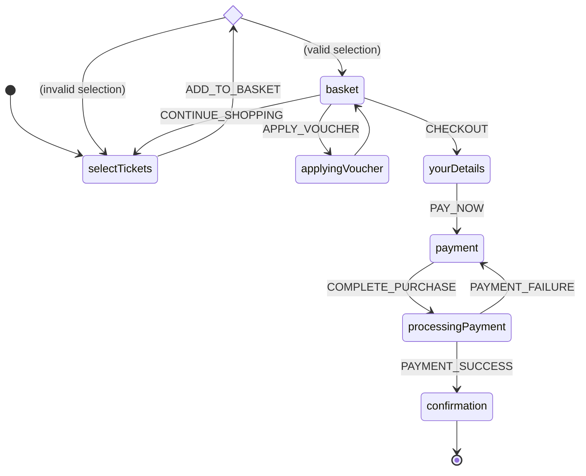

# Why state-machines?

State machines have some very desirable properties

* they can model a variety of domains including business-logic, workflows, physical objects, UI or game components, and app state
* they make the **“current state” a first class concept**, rather than some derived value, and that is almost always useful
* they are **declarative** (not imperative): you define the "rules" at compile-time, while the library provides the run-time
* state-machine definitions are usually **concise**; it is often possible to describe quite complex workflows in one typical-length source file, and therefore comprehend the whole workflow in one place, rather than referring to multiple sources. In this way they have *great signal to noise ratio*
* relatively few concepts; as with all things there is a learning curve, but it's a **simple mental model**
* they are **deterministic**: predictable and reliable
* they are **safe**: we can ensure specific events are only handled in specific states and avoid those “this should never happen” bugs altogether

## Example

Here's an example state machine diagram for a "buy tickets" user-journey

Next we're going to cover the basics of state-machines.

## State

State-machine definitions model all the possible states in which the machine can exist. 

In the above example the state-names are `selectTickets`, `validateTickets` (a transient decision-state rendered as a diamond), `basket`, `applyingVoucher`, `yourDetails`, `payment`, `paymentProcessing` and `confirmation`.

State-machine states are finite and known at the time the machine is defined (usually compile-time).

In this example we could easily use the machine's current-state name with UI router, to determine the correct page to render.

**yay-machine** (like some other state-machine libraries) provides the ability to associate dynamic data for each state, so in the above example we would want the state-machine to store the various form entries (selected tickets, user-details, etc) to complete the purchase, or show error messages.†

## Events

State-machines are event-driven and require events to move between states.

In the above example the event-types are `ADD_TO_BASKET`, `CONTINUE_SHOPPING`, `APPLY_VOUCHER`, `CHECKOUT`, `PAY_NOW`, `COMPLETE_PURCHASE`, `PAYMENT_SUCCESS` and `PAYMENT_FAILURE`.

Events are also finite and known at compile-time.

**yay-machine** provides the ability to have dynamic payloads for each event, which may be used to determine when to transition to another state.†

Events are very flexible and can be used to represent

* User mouse click
* Async database query result
* Network data packet
* Internal timer generated by the state-machine's own side-effect
* Etc

## Transitions

When the state-machine moves from one state to another, we call this a transition.

**yay-machine** supports a number of ways to transition from state to state†

* by sending an event to the machine in a certain state, if the machine has a matching transition for that state and event. In the above example the machine transitions from `yourDetails` to `payment` when sent the `PAY_NOW` event
* by sending an event to the machine in *any state*, if the machine does have a matching transition for the current state, but has a generic transition that works in *any state*. You can therefore model your machine with transitions that only handle specific events in specific states, and/or handle specific events in any state.
* transitions can be "immediate", on entering a state, we may immediately transition to another state. In the above example the `applyingVoucher` state immediately transitions back the the `basket` state
* transitions can be conditional, meaning we have multiple potential transitions, where predicate functions determine which transition (if any) is taken. In the above example the `selectTickets` state either transitions to `basket` or back to `selectTickets` if the selection is invalid
* transitions can also run side-effects (see below)

**yay-machine**'s transitions allow you to (optionally) update the next-state's associated data and run some side-effect (eg, do some logging or interact with an external service)†

All of the above features can be combined in various ways depending on requirements.

## State-data

Now you know about states, events and transitions, let's revisit "state-data"...

If states are finite where does all the other data go? Eg in the example above we would want to capture the selected tickets, user details, payment details, etc.

This is where state-data comes in; it allows us to store arbitrary data in the machine instance state, eg

* User settings
* Shopping basket items
* Other state machines
* etc

We could store these externally but there are several advantages to keeping it in the state machine

* Transition condition predicates can query the current state's data (and the event if any) to determine whether the transition should be taken
* Transitions update state (name + data) atomically, so the machine's current state (name + data) is always valid and type-safe

## Interacting with the outside world

States, events and transitions give us a lot already.

But it isn't enough to build complex real-world systems. At some point we need to interact with a web API, or query the database, or do some logging.

A good state-machine library will allow you to express these interactions within the machine definition, and actually perform those interactions (run the code) when operating machine instances.

**yay-machine** state-machines can execute [arbitrary side-effect code](../reference/side-effects.md)† at several machine and state lifecycle stages.

## Putting it all together

State-machines are a one-stop-shop for state-management.

They work well with modern paradigms like the trend towards immutable data and functional-reactive programming.

They include everything you need to model a variety of domains.

A [good TypeScript state-machine library](./why-yay-machine.md) will also give you great type-safety 😉.

---

##### Footnotes

†: these features are inspired by other state-machine libraries but are not available in every state-machine library
