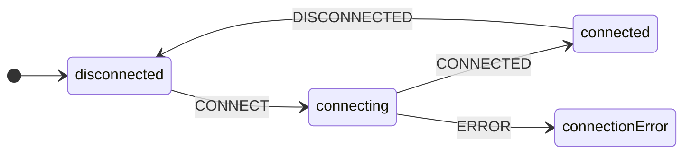

# Events

Events represent the things that affect the [state of the machine](./state.md) as it runs.

## Events are finite

Just like states, we know all the events when the machine is defined.



In this "connection" state-machine, the events are `CONNECT`, `CONNECTED`, `DISCONNECTED` and `ERROR`.

Finite means the machine will only respond to these events; the machine would ignore any other events.

## The Event type

**yay-machine** events follow the standard shape, with a `type: string` and optional "payload" (ie, any other properties you need).

```typescript
type ConnectionEvent = ConnectEvent | ConnectedEvent | ErrorEvent | DisconnectedEvent;

interface ConnectEvent {
  readonly type: 'CONNECT';
  readonly url: string;
}

interface ConnectedEvent {
  readonly type: 'CONNECTED';
}

interface DisconnectedEvent {
  readonly type: 'DISCONNECTED';
}

interface ErrorEvent {
  readonly type: 'ERROR';
  readonly error: Error;
}
```

## Sending an event to a machine

To send an event to a machine, you'll need a running instance, then simply call it's `send()` method:

```typescript
// @decorations:[{"start":{"line":3,"character":0},"end":{"line":3,"character":69},"properties":{"class":"highlight"}}]
const connectionMachine = defineMachine<ConnectionState, ConnectionEvent>({ /* ... */});

const connection = connectionMachine.newInstance().start();
connection.send({ type: 'CONNECT', url: 'ws://localhost:9999/api' });
```

Of course the machine is type-safe, so you'll get an error trying to send anything else

```typescript
// @decorations:[{"start":{"line":1,"character":0},"end":{"line":1,"character":35},"properties":{"class":"highlight remove"}}]
// ❌ ts(2322): Type '"HELLO"' is not assignable to type '"CONNECT" | "CONNECTED"' | "DISCONNECTED"' | "ERROR"'. 
connection.send({ type: 'HELLO' }); 
```

## Event payload

When your events have a payload (any other properties apart from `type`), you can use these to 

* generate state data for the next state [in a transition](./transitions.md)
* determine which [conditional transition](./transitions.md) to take

```typescript
// @decorations:[{"start":{"line":2,"character":49},"end":{"line":2,"character":70},"properties":{"class":"highlight"}}, {"start":{"line":3,"character":40},"end":{"line":3,"character":70},"properties":{"class":"highlight"}}, {"start":{"line":12,"character":10},"end":{"line":12,"character":50},"properties":{"class":"highlight"}}, {"start":{"line":20,"character":10},"end":{"line":20,"character":71},"properties":{"class":"highlight"}}, {"start":{"line":39,"character":35},"end":{"line":39,"character":65},"properties":{"class":"highlight"}}]
type ConnectionState = 
  | { readonly name: 'disconnected'; }
  | { readonly name: 'connecting' | 'connected'; readonly url: string; } 
  | { readonly name: 'connectionError'; readonly errorMessage: string; };

const connectionMachine = defineMachine<ConnectionState, ConnectionEvent>({
  initialState: { name: "disconnected", url: '<none>' },
  states: {
    disconnected: {
      on: {
        CONNECT: {
          to: "connecting",
          data: ({ event: { url } }) => ({ url }),
        },
      },
    },
    connecting: {
      on: {
        ERROR: {
          to: "connectionError",
          data: ({ event }) => ({ errorMessage: String(event.error) }),
        },
      },
    },
    // ...
  },
});

const connection = connectionMachine.newInstance().start();

connection.subscribe(({ state }) => {
  if (state.name === 'connecting') {
    console.log('connecting to', state.url);
  }
  if (state.name === 'connectionError') {
    console.log('connectionFailed: %s', state.errorMessage);
  }
})

connection.send({ type: 'CONNECT', url: 'ws://localhost:9999/api' });
```

## Subscribers receive last event

When you subscribe for state changes, you *might also* get the event which triggered the state change.

```typescript
// @decorations:[{"start":{"line":1,"character":31},"end":{"line":1,"character":36},"properties":{"class":"highlight"}}, {"start":{"line":3,"character":59},"end":{"line":3,"character":64},"properties":{"class":"highlight"}}]
const connection = connectionMachine.newInstance().start();
connection.subscribe(({ state, event }) => {
  // event: ConnectionEvent | undefined
  console.log('now in state %s, due to event', state.name, event);
})
```

When an event triggers a state-transition, `event` will be that event.

Sometimes `event` will be `undefined`:

* the first time the subscriber callback is called: it only receives the machine's current state
* when the machine transitions to a new state due to an immediate (always) transition; this is an "eventless" transition

---

<!-- GUIDED PATH NAVIGATION -->

* [Previous page: **States**](./state.md)
* [Next page: **Transitions**](./transitions.md)
