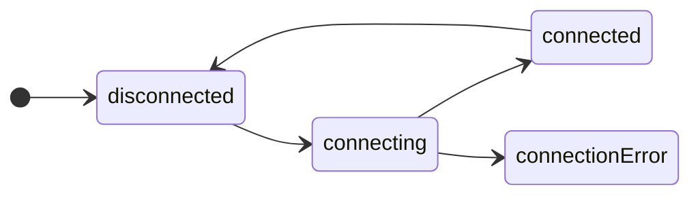

# State

State represents all the possible states in which a machine can exist.

> 💡 Remember: machines can model business-logic, workflows, game or UI components, app state, ... lots of things.
> So when we say *"all the possible states in which a machine can exist"* we mean "all the possible states in which **the thing you are modelling** can exist".

## States are finite

This means that we know all the states when the machine is defined.



In this "connection" state-machine, the states are `'disconnected'`, `'connecting'`, `'connected'` and `'connectionError'`.

Finite means the machine will only ever be in one of these states; new states cannot be created dynamically (at run-time).

## State is a type

In **yay-machine** the machine's state is a TypeScript type with a `name: string` property, and any other associated data.

So we might start to build the above machine like

```typescript
import { defineMachine } from 'yay-machine';

interface ConnectionState {
  readonly name: 'disconnected' | 'connecting' | 'connected' | 'connectionError';
}

interface ConnectionEvent {
  readonly type: '???'; // we'll cover this next
}

const connectionMachine = defineMachine<ConnectionState, ConnectionEvent>({
  initialState: { name: 'disconnected' },
  // ...
});
```

## Getting a machine's current state

When we have an instance of a machine we can query its current state

```typescript
const connection = connectionMachine.newInstance().start();

// `machine.state` is a property getter that always returns the machine's current state.
// Note the `const state: ConnectionState` - our state type
const state: ConnectionState = connection.state;

assert(state).deepStrictEqual({ name: 'disconnected' });
```

## Subscribing to a machine's state changes

We can subscribe to machine's state, to be notified about state changes as they happen

```typescript
const connection = connectionMachine.newInstance().start();

// the type of `state` is `ConnectionState` - our state type
const unsubscribe = connection.subscribe(({ state }) => {
  switch (state.name) {
    'disconnected':
      console.log('we are disconnected 🤷');
      break;
    
    'connecting':
      console.log('connecting now... 👋');
      break;
    
    'connected':
      console.log('yay, connected 🤝');
      break;
    
    'connectionError':
      console.log('connection failed 😢');
      break;
  }
});

// ... later

unsubscribe(); // callback no longer receives state changes
```

## States can have associated data (homogenous)

As well as a `name`, state types can have additional data properties

```typescript
interface ConnectionState {
  readonly name: 'disconnected' | 'connecting' | 'connected' | 'connectionError';
  readonly connectingStartedAt: number; // Date.now();
  readonly connectionEstablishedAt: number; // Date.now();
}
```

The machine manages the data as it runs, by providing a `data()` callback to generate data for the next state

```typescript
const connectionMachine = defineMachine<ConnectionState, ConnectionEvent>({
  initialState: { name: 'disconnected', connectingStartedAt: -1, connectionEstablishedAt: -1 },
  states: {
    disconnected: {
      on: {
        CONNECT: { to: 'connecting', data: () => ({ connectingStartedAt: Date.now(), connectionEstablishedAt: -1 }) },
      },
    },
    connecting: {
      on: {
        CONNECTED: { 
          to: 'connected', 
          data: ({ state }) => ({ connectingStartedAt: state.connectingStartedAt, connectionEstablishedAt: -1 })
        },
      },
    },
    // ...
  },
});
```

Later we could query the data

```typescript
const connection = connectionMachine.newInstance().start();

// ... use the machine ...

if (connection.state.name === 'connected') {
  console.log(
    'It took %s milliseconds to establish the connection, and its uptime is %s millis', 
    connection.state.connectionEstablishedAt - connection.state.connectingStartedAt
    Date.now() - connection.state.connectionEstablishedAt
  );
}
```

We can also define [conditional transitions](./transitions.md) that query both state-data and event-payloads to decide which transition to take.


## States can have associated data (heterogenous)

If we like, we can define state types with different data

```typescript
type ConnectionState = 
  | { readonly name: 'disconnected' }
  | { readonly name: 'connecting'; readonly connectingStartedAt: number; /* Date.now(); */ }
  | { readonly name: 'connected'; readonly connectingStartedAt: number; /* Date.now(); */; readonly connectionEstablishedAt: number; /* Date.now() */ }
  | { readonly name: 'connectionError'; readonly errorMessage: string };
```

The machine manages the data as it runs, by providing a `data()` callback to generate data for the next state

```typescript
const connectionMachine = defineMachine<ConnectionState, ConnectionEvent>({
  initialState: { name: "disconnected" },
  states: {
    disconnected: {
      on: {
        CONNECT: { to: "connecting", data: () => ({ connectingStartedAt: Date.now() }) },
      },
    },
    connecting: {
      on: {
        CONNECTED: {
          to: "connected",
          data: ({ state }) => ({ connectingStartedAt: state.connectingStartedAt, connectionEstablishedAt: -1 }),
        },
        ERROR: {
          to: "connectionError",
          data: ({ event }) => ({ errorMessage: String(event.error) }),
        },
      },
    },
    // ...
  },
});
```

Later we could query the data with complete type-safety

```typescript
const connection = connectionMachine.newInstance().start();

// ... use the machine ...

if (connection.state.name === 'connected') {
  console.log(
    'It took %s milliseconds to establish the connection, and its uptime is %s millis', 
    connection.state.connectionEstablishedAt - connection.state.connectingStartedAt
    Date.now() - connection.state.connectionEstablishedAt
  );
} else if (connection.state.name === 'connectionError') {
  console.log('Connection failed: %s', connection.state.errorMessage);
}
```

---

* [⬅️ Previous: **Docs**](./readme.md)
* [Next: **Events** ➡️](./events.md)
