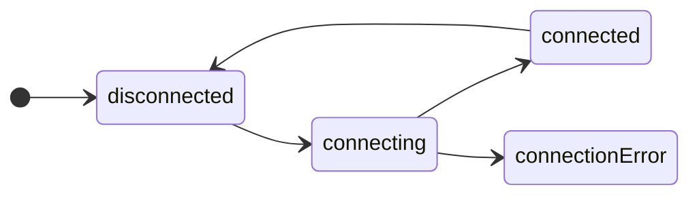

# State

State represents all the possible states in which a machine can exist.

> 💡 **Remember**
>
> Machines can model business-logic, workflows, game or UI components, app state, ... lots of things.
>
> So when we say *"all the possible states in which a machine can exist"* we mean "all the possible states in which **the thing you are modelling** can exist".

## States are finite

This means that we know all the states when the machine is defined.



In this "connection" state-machine, the states are `disconnected`, `connecting`, `connected` and `connectionError`.

Finite means the machine will only ever be in one of these states; new states cannot be created dynamically (at run-time).

## State is a type

In **yay-machine** the machine's state is a TypeScript type with a `name: string` property, and any other associated data.

So we might start to build the above machine like

```typescript
// @decorations:[{"start":{"line":2,"character":0},"end":{"line":4,"character":1},"properties":{"class":"highlight"}}]
import { defineMachine } from 'yay-machine';

interface ConnectionState {
  readonly name: 'disconnected' | 'connecting' | 'connected' | 'connectionError';
}

interface ConnectionEvent {
  readonly type: '???'; // we'll cover this next
}

const connectionMachine = defineMachine<ConnectionState, ConnectionEvent>({
  initialState: { name: 'disconnected' },
  // ...
});
```

## Get a machine's current state

When we have an instance of a machine we can query its current state

```typescript
// @decorations:[{"start":{"line":2,"character":7},"end":{"line":2,"character":23},"properties":{"class":"highlight"}}]
const connection = connectionMachine.newInstance().start();

assert(connection.state).deepStrictEqual({ name: 'disconnected' });
```

`machine.state` is a *property getter* that always returns the machine's current state, and whose type is the machine's state-type, in our case `ConnectionState`.

## Subscribing to a machine's state

We can subscribe to a machine's state, to be notified about state changes as they happen

```typescript
// @decorations:[{"start":{"line":3,"character":20},"end":{"line":3,"character":57},"properties":{"class":"highlight"}}]
const connection = connectionMachine.newInstance().start();

// the type of `state` is `ConnectionState` - our state type
const unsubscribe = connection.subscribe(({ state }) => {
  switch (state.name) {
    'disconnected':
      console.log('we are disconnected 🤷');
      break;
    
    'connecting':
      console.log('connecting now... 👋');
      break;
    
    'connected':
      console.log('yay, connected 🤝');
      break;
    
    'connectionError':
      console.log('connection failed 😢');
      break;
  }
});

// ... later

unsubscribe(); // callback no longer receives state changes
```

## Homogenous state data

As well as a `name`, state types can have additional data properties

```typescript
// @decorations:[{"start":{"line":2,"character":0},"end":{"line":3,"character":58},"properties":{"class":"highlight"}}]
interface ConnectionState {
  readonly name: 'disconnected' | 'connecting' | 'connected' | 'connectionError';
  readonly connectingStartedAt: number; // Date.now();
  readonly connectionEstablishedAt: number; // Date.now();
}
```

In this case we say the state-data is homogenous, because for all states  - 
`disconnected`, `connecting`, `connected` and `connectionError` - the associated state-data has the same shape (type).

The machine manages the data as it runs, by providing a `data()` callback to generate data for the next state

```typescript
// @decorations:[{"start":{"line":11,"character":0},"end":{"line":14,"character":13},"properties":{"class":"highlight"}}, {"start":{"line":22,"character":0},"end":{"line":25,"character":13},"properties":{"class":"highlight"}}]
const connectionMachine = defineMachine<ConnectionState, ConnectionEvent>({
  initialState: {
    name: 'disconnected',
    connectingStartedAt: -1,
    connectionEstablishedAt: -1
  },
  states: {
    disconnected: {
      on: {
        CONNECT: {
          to: 'connecting',
          data: () => ({
            connectingStartedAt: Date.now(),
            connectionEstablishedAt: -1
          }),
        },
      },
    },
    connecting: {
      on: {
        CONNECTED: { 
          to: 'connected', 
          data: ({ state }) => ({
            connectingStartedAt: state.connectingStartedAt,
            connectionEstablishedAt: -1
          }),
        },
      },
    },
    // ...
  },
});
```

Later we could query the data

```typescript
// @decorations:[{"start":{"line":4,"character":4},"end":{"line":4,"character":41},"properties":{"class":"highlight"}}, {"start":{"line":7,"character":4},"end":{"line":7,"character":84},"properties":{"class":"highlight"}}, {"start":{"line":8,"character":17},"end":{"line":8,"character":58},"properties":{"class":"highlight"}}]
const connection = connectionMachine.newInstance().start();

// ... use the machine ...

if (connection.state.name === 'connected') {
  console.log(
    'It took %s milliseconds to establish the connection, and its uptime is %s millis', 
    connection.state.connectionEstablishedAt - connection.state.connectingStartedAt,
    Date.now() - connection.state.connectionEstablishedAt,
  );
}
```

We can also define [conditional transitions](./transitions.md) that query both state-data and event-payloads to decide which transition to take.

### `enableCopyDataOnTransition`

For machines with homogenous state-data and a lot of transitions, you might find you are writing a lot of
boilerplate `data()` callbacks that simply copy the state, eg

```typescript
// @decorations:[{"start":{"line":24,"character":10},"end":{"line":24,"character":37},"properties":{"class":"highlight smell"}}]
interface ToggleState {
  readonly name: 'off' | 'on';
  readonly onTimes: number;
}

interface ToggleEvent {
  readonly type: 'TOGGLE';
}

const toggleMachine = defineMachine<ToggleState, ToggleEvent>({
  initialState: { name: 'off', onTimes: 0 },
  states: {
    off: {
      on: {
        TOGGLE: {
          to: 'on', 
          data: ({ state }) => ({ onTimes: state.onTimes + 1 }), // update state-data
        },
      },
    },
    on: {
      on: {
        TOGGLE: {
          to: 'off',
          data: ({ state }) => state, // :-( this isn't adding any value
        },
      },
    },
  },
});
```

If your machine has a lot of transitions that don't actually change the state-data, this means a lot of extra boilerplate and a lot of noise.

In this case you can do

```typescript
// @decorations:[{"start":{"line":1,"character":2},"end":{"line":1,"character":35},"properties":{"class":"highlight add"}}, {"start":{"line":14,"character":8},"end":{"line":14,"character":30},"properties":{"class":"highlight add"}}]
const toggleMachine = defineMachine<ToggleState, ToggleEvent>({
  enableCopyDataOnTransition: true, // add this
  initialState: { name: 'off', onTimes: 0 },
  states: {
    off: {
      on: {
        TOGGLE: {
          to: 'on',
          data: ({ state }) => ({ onTimes: state.onTimes + 1 }) // update state-data
        },
      },
    },
    on: {
      on: {
        TOGGLE: { to: 'off' }, // :-) state is now copied from `off` to `on`
      },
    },
  },
});
```

> 💡 See the [Health (game component) example](../examples/health.md) for more realistic usage.

## Heterogenous state data

If we like, we can define state types with different data

```typescript
type ConnectionState = 
  | { readonly name: 'disconnected' }
  | { readonly name: 'connecting'; readonly connectingStartedAt: number; /* Date.now(); */ }
  | { readonly name: 'connected'; readonly connectingStartedAt: number; /* Date.now(); */; readonly connectionEstablishedAt: number; /* Date.now() */ }
  | { readonly name: 'connectionError'; readonly errorMessage: string };
```

In this case we say the state-data is heterogenous, because for some or all states the associated state-data has a different shape (type).

The machine manages the data as it runs, by providing a `data()` callback to generate data for the next state

```typescript
// @decorations:[{"start":{"line":7,"character":0},"end":{"line":9,"character":13},"properties":{"class":"highlight"}}, {"start":{"line":17,"character":0},"end":{"line":20,"character":13},"properties":{"class":"highlight"}}, {"start":{"line":24,"character":0},"end":{"line":26,"character":13},"properties":{"class":"highlight"}}]
const connectionMachine = defineMachine<ConnectionState, ConnectionEvent>({
  initialState: { name: "disconnected" },
  states: {
    disconnected: {
      on: {
        CONNECT: {
          to: "connecting",
          data: () => ({
            connectingStartedAt: Date.now()
          }),
        },
      },
    },
    connecting: {
      on: {
        CONNECTED: {
          to: "connected",
          data: ({ state }) => ({
            connectingStartedAt: state.connectingStartedAt,
            connectionEstablishedAt: -1,
          }),
        },
        ERROR: {
          to: "connectionError",
          data: ({ event }) => ({
            errorMessage: String(event.error),
          }),
        },
      },
    },
    // ...
  },
});
```
Later we can query the data with complete type-safety

```typescript
// @decorations:[{"start":{"line":4,"character":4},"end":{"line":4,"character":41},"properties":{"class":"highlight"}}, {"start":{"line":7,"character":4},"end":{"line":7,"character":84},"properties":{"class":"highlight"}}, {"start":{"line":8,"character":4},"end":{"line":8,"character":58},"properties":{"class":"highlight"}}, {"start":{"line":10,"character":11},"end":{"line":10,"character":54},"properties":{"class":"highlight"}}, {"start":{"line":11,"character":39},"end":{"line":11,"character":68},"properties":{"class":"highlight"}}]
const connection = connectionMachine.newInstance().start();

// ... use the machine ...

if (connection.state.name === 'connected') {
  console.log(
    'It took %s milliseconds to establish the connection, and its uptime is %s millis', 
    connection.state.connectionEstablishedAt - connection.state.connectingStartedAt,
    Date.now() - connection.state.connectionEstablishedAt,
  );
} else if (connection.state.name === 'connectionError') {
  console.log('Connection failed: %s', connection.state.errorMessage);
}
```

## State data is immutable

> **⚠️ Important**
>
> Never mutate state data in a `data()` callback.
>
> Always generate and return a new data object.

## State lifecycle side-effects

States may define two optional [side-effect](./side-effects.md) callbacks that are executed when the state is entered and exited respectively

```typescript
// @decorations:[{"start":{"line":5,"character":0},"end":{"line":5,"character":80},"properties":{"class":"highlight"}}, {"start":{"line":6,"character":0},"end":{"line":6,"character":85},"properties":{"class":"highlight"}}]
const connectionMachine = defineMachine<ConnectionState, ConnectionEvent>({
  initialState: { name: "disconnected" },
  states: {
    // ...
    connected: {
      onEnter: ({ state }) => { console.log('now connected to %s', state.url )},
      onExit: ({ state }) => { console.log('no longer connected to %s', state.url )},
    },
    // ...
  },
});
```

---

<!-- GUIDED PATH NAVIGATION -->

* [Previous page: **Quick start**](../quick-start.md)
* [Next page: **Events**](./events.md)
