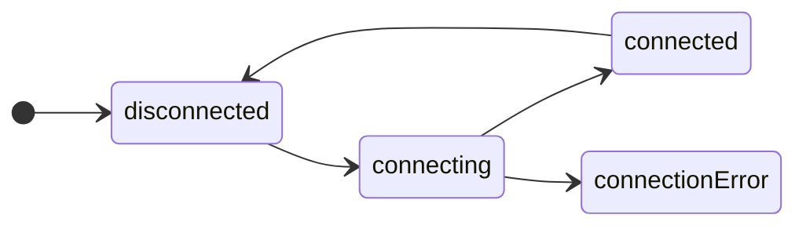

# State

State is the primary concept of state-machines and represents all the possible states in which a machine can exist.

> 💡 Remember: machines can model business-logic, workflows, game or UI components, app state, ... lots of things.
> So when we say *"all the possible states in which a machine can exist"* we mean "all the possible states in which **the thing you are modelling** can exist".

## States a are finite

This means that we know all the states when the machine is defined.



In this "connection" state-machine, the states are `'disconnected'`, `'connecting'`, `'connected'` and `'connectionError'`.

Finite means the machine will only ever be in one of these states; new states cannot be created dynamically (at run-time).

## State is a type

In **yay-machine** the machine's state is a TypeScript type with a `name: string` property, and any other associated data.

So we might start to build the above machine like

```typescript
import { defineMachine } from 'yay-machine';

interface ConnectionState {
  readonly name: 'disconnected' | 'connecting' | 'connected' | 'connectionError';
}

interface ConnectEvent {
  readonly type: '???'; // we'll cover this next
}

const connectionMachine = defineMachine<ConnectionState, ConnectionEvent>({
  initialState: { name: 'disconnected' },
  // ...
});
```

When we have an instance of a machine we can query its current state

```typescript
const connection = connectionMachine.newInstance().start();

// `machine.state` is a property getter that always returns the machine's current state.
// Note that the `const state` has the type `ConnectionState`, our state type
const state: ConnectionState = connection.state;

assert(state).deepStrictEqual({ name: 'disconnected' });
```

## Subscribing for state changes

We can subscribe to machine's state, to be notified about state changes as they happen

```typescript
const connection = connectionMachine.newInstance().start();

const unsubscribe = connection.subscribe(({ state }) => {
  switch (state.name) {
    'disconnected':
      console.log('we are disconnected 🤷');
      break;
    
    'connecting':
      console.log('connecting now... 👋');
      break;
    
    'connected':
      console.log('yay, connected 🤝');
      break;
    
    'connectionError':
      console.log('connection failed 😢');
      break;
  }
});

// ... later

unsubscribe(); // callback no longer receives state changes
```

## States can have associated data

It's quite convenient to store any data associated with the machine *within the machine's state types*.

```typescript
export interface CalculatorState {
  /**
   * equals: we're currently displaying the memory (last result)
   * plus: we will add the memory to the next complete input number
   * times: we will multiply the memory to the next complete input number
   */
  readonly name: "equals" | "plus" | "times";
  /**
   * The last result that we are either displaying, or going to calculate with
   */
  readonly memory?: number;
  /**
   * The current user-input
   */
  readonly input?: string;
}
```

Doing this means we can create [conditional transitions](./transitions.md) based on the current state-data

```typescript
  on: {
    KEY: [
      {
        to: "equals",
        when: ({ state, event }) => event.key === "=" && state.memory !== undefined && state.input !== undefined,
        data: ({ state }) => ({ memory: calc(state.memory!, state.name, Number.parseInt(state.input!, 10)) }),
      },
      {
        to: "equals",
        when: ({ state, event }) => event.key === "=" && state.memory !== undefined,
        data: ({ state }) => ({ memory: state.memory! }),
      },
      // ...
    ]
  }
```
---

TODO

- state-data (two kinds)


The example below demonstrates our this with state-specific-data (aka heterogenous state-data), but we also support state-common-data (aka homogenous state-data).

```typescript
export type ResultState =
  | { readonly name: "pending" }
  | { readonly name: "result"; readonly result: unknown }
  | { readonly name: "error"; readonly errorMessage: string };

export type ResultEvent =
  | { readonly type: "RESULT"; readonly result: unknown }
  | { readonly type: "ERROR"; readonly error: Error };

export const resultMachine = defineMachine<ResultState, ResultEvent>({
  initialState: { name: "pending" },
  states: {
    pending: {
      on: {
        RESULT: {
          to: "result",
          data: ({ event }) => ({ result: event.result }),
        },
        ERROR: {
          to: "error",
          data: ({ event }) => ({ errorMessage: String(event.error) }),
        },
      },
    },
  },
});

const result = resultMachine.newInstance().start();

// ... use the machine ...

// type-safe access to state-specific-data
const state: ResultState = result.state;
if (state.name === "result") {
  console.log("OK, result is", state.result);           
} else if (state.name === "error") {
  console.log("OH NO, error is", state.errorMessage);
}
```

---

| Previous | Next |
| --- | --- |
| [⬅️  **Docs**](./readme.md) | [**Events** ➡️](./events.md)  |
