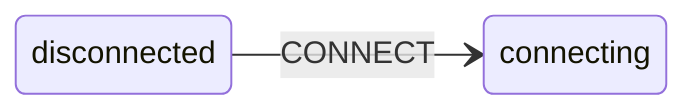
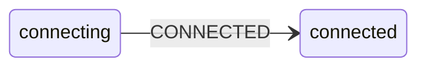
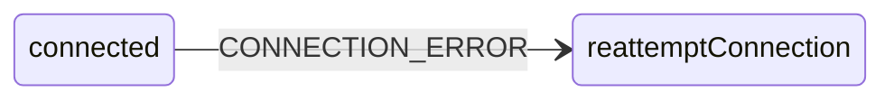
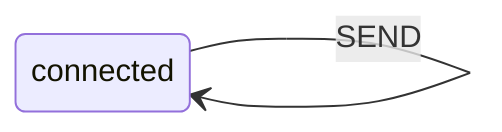
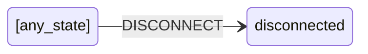
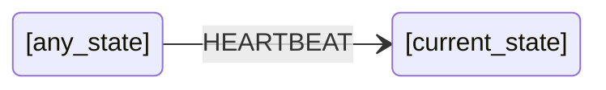
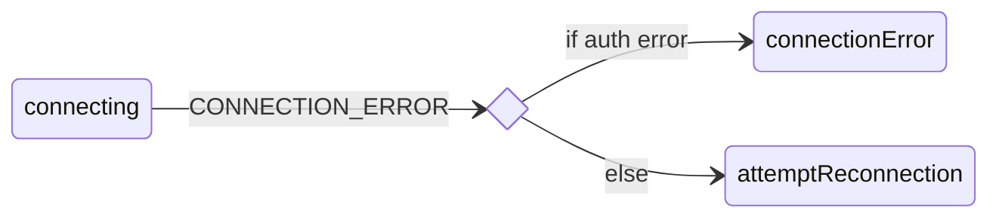
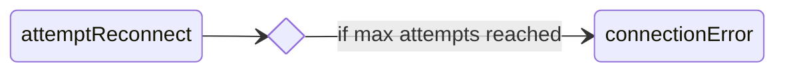

# Transitions

Transitions bring state-machines to life, defining when and how they move from state-to-state.

## Example: connection machine

We will expand on the "connection machine" example we used when explaining [states](./state.md) and [events](./events.md), to illustrate various transitions.

> 😜 This is an example, created for teaching purposes - don't take it too seriously 

First, here is the complete machine. In the following sections we explore the various different transition techniques it uses.

> 💡 View this example's <a href="https://github.com/maurice/yay-machine/blob/main/packages/example-machines/src/connectionMachine.ts" target="_blank">source</a> and <a href="https://github.com/maurice/yay-machine/blob/main/packages/example-machines/src/__tests__/connectionMachine.test.ts" target="_blank">test</a> on GitHub

```typescript
import { defineMachine } from "yay-machine";

/*
 * Fictitious external "transport / connection" API
 */

interface Transport {
  connect(url: string): Connection;
}

interface Connection {
  onconnect?: (connectionId: string) => void;
  onmessage?: (data: string) => void;
  onerror?: (error: ConnectionError) => void;
  send(data: string): void;
  disconnect(): void;
}

interface ConnectionError {
  readonly code: number;
  readonly errorMessage: string;
}

/*
 * Application connection state-machine
 */

interface StateData {
  readonly maxReconnectionAttempts: number;
  readonly log: (message: string) => void;
  readonly transport: Transport;
  readonly onReceive: (data: string) => void;
  readonly lastHeartbeatTime: number;
}

interface DisconnectedState extends StateData {
  readonly name: "disconnected";
}

interface ConnectionAttemptState {
  readonly url: string;
  readonly connectionAttemptNum: number;
}

interface ConnectingState extends StateData, ConnectionAttemptState {
  readonly name: "connecting";
}

interface ReattemptConnectionState extends StateData, ConnectionAttemptState {
  readonly name: "reattemptConnection";
}

interface ConnectedState extends StateData, ConnectionAttemptState {
  readonly name: "connected";
  readonly connectionId: string;
  readonly connection: Connection;
}

interface ConnectionErrorState extends StateData, ConnectionAttemptState {
  readonly name: "connectionError";
  readonly errorMessage: string;
}

type ConnectionState =
  | DisconnectedState
  | ConnectingState
  | ReattemptConnectionState
  | ConnectedState
  | ConnectionErrorState;

type ConnectionEvent =
  | { readonly type: "CONNECT"; readonly url: string }
  | {
      readonly type: "CONNECTED";
      readonly connectionId: string;
      readonly connection: Connection;
    }
  | { readonly type: "SEND"; readonly data: string }
  | {
      readonly type: "CONNECTION_ERROR";
      readonly code: number;
      readonly errorMessage: string;
    }
  | { readonly type: "HEARTBEAT" }
  | { readonly type: "DISCONNECT" }
  | { readonly type: "DISCONNECTED" };

const isAuthError = (code: number) => code === 401 || code === 403;

/**
 * Models a client connection via a fictitious "transport / connection" API.
 * Demonstrates various transitions configurations:
 * - specific state + event
 * - any state + event
 * - immediate
 * - conditionals, single and multi
 * - `reenter:false`
 */
export const connectionMachine = defineMachine<
  ConnectionState,
  ConnectionEvent
>({
  initialState: {
    name: "disconnected",
    maxReconnectionAttempts: 10,
    log: undefined!, // provided at runtime, per machine-instance
    transport: undefined!, // provided at runtime, per machine-instance
    onReceive: undefined!, // provided at runtime, per machine-instance
    lastHeartbeatTime: -1,
  },
  states: {
    disconnected: {
      on: {
        CONNECT: {
          to: "connecting",
          data: ({ state, event: { url } }) => ({
            ...state,
            url,
            connectionAttemptNum: 1,
          }),
        },
      },
    },
    connecting: {
      onEnter: ({ state: { log, transport, url }, send }) => {
        log(`connecting to ${url}`);
        const connection = transport.connect(url);
        connection.onconnect = (connectionId) =>
          send({ type: "CONNECTED", connectionId, connection });
        connection.onerror = (error) =>
          send({ type: "CONNECTION_ERROR", ...error });
      },
      on: {
        CONNECTED: {
          to: "connected",
          data: ({ state, event: { connectionId, connection } }) => ({
            ...state,
            connectionId,
            connection,
          }),
        },
        CONNECTION_ERROR: [
          {
            to: "connectionError",
            when: ({ event }) => isAuthError(event.code),
            data: ({ state, event: { errorMessage } }) => ({
              ...state,
              errorMessage,
            }),
          },
          {
            to: "reattemptConnection",
            data: ({ state }) => state,
          },
        ],
      },
    },
    connected: {
      onEnter: ({ state: { log, url, connection, onReceive }, send }) => {
        log(`connected to ${url}`);
        connection.onerror = (error) =>
          send({ type: "CONNECTION_ERROR", ...error });
        connection.onmessage = (data) => {
          if (data === "❤️ HEARTBEAT") {
            send({ type: "HEARTBEAT" });
          } else {
            onReceive(data);
          }
        };
      },
      onExit: ({ state }) => {
        state.log(`disconnecting from ${state.url}`);
        state.connection.disconnect();
      },
      on: {
        SEND: {
          to: "connected",
          reenter: false,
          onTransition: ({ state, event }) => {
            state.connection.send(event.data);
          },
        },
        CONNECTION_ERROR: {
          to: "reattemptConnection",
          data: ({ state }) => ({ ...state, connectionAttemptNum: 0 }),
        },
      },
    },
    reattemptConnection: {
      onEnter: ({ state: { log, url }, send }) => {
        log("waiting to re-attempt connection...");
        const timer = setTimeout(
          () => send({ type: "CONNECT", url }),
          Math.round(Math.random() * 10_000),
        );
        return () => clearTimeout(timer);
      },
      on: {
        CONNECT: {
          to: "connecting",
          data: ({ state, event: { url } }) => ({
            ...state,
            url,
            connectionAttemptNum: state.connectionAttemptNum + 1,
          }),
          onTransition: ({ state: { log, url } }) => {
            log(`re-attempting connection to ${url}`);
          },
        },
      },
      always: {
        to: "connectionError",
        when: ({ state: { connectionAttemptNum, maxReconnectionAttempts } }) =>
          connectionAttemptNum === maxReconnectionAttempts,
        data: ({ state }) => ({
          ...state,
          errorMessage: `Max connection attempts (${state.connectionAttemptNum}) reached for url=${state.url}`,
        }),
      },
    },
  },
  on: {
    HEARTBEAT: {
      data: ({ state }) => ({ ...state, lastHeartbeatTime: Date.now() }),
    },
    DISCONNECT: {
      to: "disconnected",
      data: ({
        state: { maxReconnectionAttempts, log, transport, onReceive },
      }) => ({
        maxReconnectionAttempts,
        log,
        transport,
        onReceive,
        lastHeartbeatTime: -1,
      }),
    },
  },
});
```

### Usage

```typescript
const transport: Transport = {
  // @ts-expect-error - example code
  connect(url: string) {
    return {
      /* ... */
    };
  },
};

const onReceive = (data: string) => {
  console.log("received from server: ", data);
};

const connection = connectionMachine
  .newInstance({
    initialState: {
      name: "disconnected",
      maxReconnectionAttempts: 10,
      log: console.log.bind(console),
      transport,
      onReceive,
      lastHeartbeatTime: -1,
    },
  })
  .start();

connection.subscribe(({ state }) => {
  if (state.name === "connected") {
    connection.send({ type: "SEND", data: "hello from client" });
  }
});

connection.send({ type: "CONNECT", url: "foo://bar/baz" });
```

## Specific State, On Event

The simplest and most obvious types of transition are done in a specific state, because of a specific event.

In the above machine we see this for 







(And elsewhere.)

These types of transitions are defined at `states[stateName].on[EVENT_NAME]` in the definition config

```typescript
const machine = defineMachine<State, Event>({
  states: {
    [stateName]: {
      on: {
        [EVENT_NAME]: { 
          to: 'nextStateName',
          /* ... other options ... */ 
        },
        // ...
      },
    },
    // ...
  },
});
```

### `reenter: false`

In some cases we want to handle an event in a specific state, and remain in the same state, without exiting and re-entering the state.

In the above machine we see this happens for



This can be used to perform a **transition side-effect** and still keep any current **state entry side-effect** active (ie, not call their cleanup function, and allow them to continue to `send` events to the machine).

Simply add `reenter: false` to the transition

```typescript
const machine = defineMachine<State, Event>({
  states: {
    [stateName]: {
      on: {
        [EVENT_NAME]: { 
          to: stateName,                                        // remain in current state
          reenter: false,
          onTransition: ({ state, event }) => ({ /* ... */ })   // optional side-effect
        },
        // ...
      },
    },
    // ...
  },
});
```

## Any State, On Event

In some cases it's more convenient to handle an event in *any state*.

In the above machine we see this for



These types of transitions are defined at `on[EVENT_NAME]` in the definition config

```typescript
const machine = defineMachine<State, Event>({
  // ...
  on {
    [EVENT_NAME]: { 
      to: 'nextStateName',
      /* ... other options ... */ 
    },
  },
});
```

### Optional `to`

Sometimes we want to handle an event in *any state* and then **return to the current state**.

In the above machine we see this for the `HEARTBEAT` event 



This technique is typically used to update state-data. For example, the connection machine updates the `lastHeartbeatTime` state-data property whenever it receives a `HEARTBEAT` event.


```typescript
const machine = defineMachine<State, Event>({
  // ...
  on {
    [EVENT_NAME]: { 
      data: ({ state, event }) => ({ ...state, /* ... */ }),
    },
  },
});
```

## Conditional transitions: `when()`

Wherever you can define a transition, you can also define an array of transitions, where some or all have a `when()` callback.

In the above machine we see this happens for



The `when()` callback takes the current `state` and `event`, and SHOULD be pure and deterministic, ie, only using `state` and `event` to decide which transition to take.

Transitions are attempted in order and the first `when()` to return `true`, or first transition without a `when()`, is taken. If no `when()`s return true, no transitions are taken.

```typescript
const machine = defineMachine<State, Event>({
  states: {
    [stateName]: {
      on: {
        [EVENT_NAME]: [
          { to: 'firstState', when: ({ state, event }) => { /* ... */ }, /* ... other options */ },
          { to: 'firstState', when: ({ state, event }) => { /* ... */ }, /* ... other options */ },
          { to: 'secondState', when: ({ state, event }) => { /* ... */ }, /* ... other options */ },
          { to: 'thirdState', /* ... other options */ },
        ]
      }
    }
    // ...
  },
  on {
    [OTHER_EVENT_NAME]: [
      // array of potential transitions
    ],
  },
});
```

## Immediate transitions: `always`

Immediate transitions (often combined with conditional transitions) are taken immediately, on entering a state.

In the above machine we see this happens for



Immediate transitions are optionally defined in state nodes in the definition config at `states[stateName].always`

```typescript
const machine = defineMachine<State, Event>({
  states: {
    [stateName]: {
      always: [{ /* transition(s) */ }] 
    }
  },
  // ...
});
```

## Generate state data: `data()`

Since states can have associated data, you often need to provide a `data()` callback in the transition to generate the data for the next state.

This callback MUST only ever generate a new object. DO NOT mutate the current state data.

The callback receives the current `state` and `event`.

The callback SHOULD be pure and deterministic, and only use data from `state` and `event` to compute the data for the next state.

For *homogenous* state-data you also have the option to set `enableCopyDataOnTransition: true` to avoid some boilerplate. See the [states](./state.md) documentation for a longer discussion.

## Combining transitions

We can mix-n-match most of the above, eg

- all the different transition configuration nodes (state + event, *any state* + event, always) all support single and multiple transitions
- all the different transition configuration nodes support `when()`, `data()` and `onTransition()`
- state transition configuration MAY combine event and always transitions (the `reattemptConnection` state does this)

The two *special cases* in the configuration are

- no `to` in an *any state* transition means exit and re-enter the current state, updating data if relevant
- `reenter: false` in a state + event transition means perform the optional side-effect but do not exit re-enter the current state or update data

## Side-effects: `onTransition()`

Transitions can define side-effects: an `onTransition()` function that is called if and when the transition is taken.

In the above state machine there are transition side effects when handling

- the `SEND` event in the `connected` state
- the `CONNECT` event in the `reattemptConnection` state

The `onTransition()` function receives the current `state`, `event`, and a `send` function which can be used to send events back to the machine instance. It MAY return a cleanup function to release any associated resources, and if so that is called immediately after the `onTransition()` itself.

---

<!-- GUIDED PATH NAVIGATION -->

* [Previous page: **Events**](./events.md)
* [Next page: **Side-effects**](./side-effects.md)
