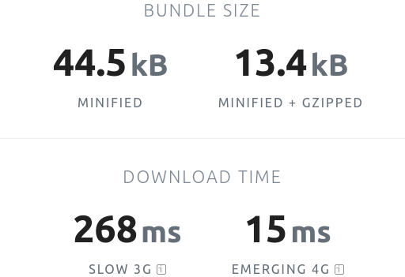
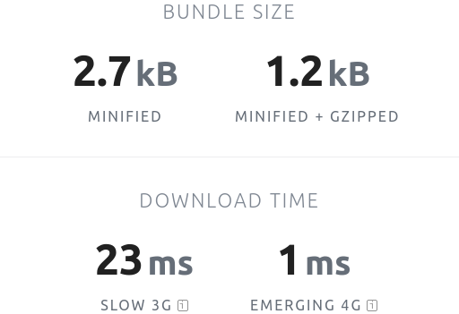
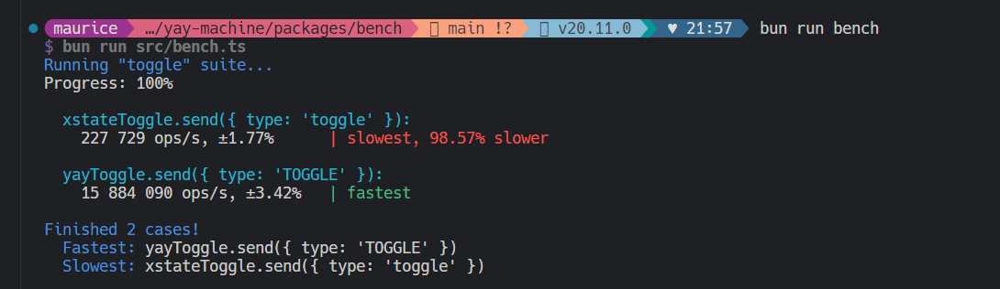

How does **yay-machine** stack-up against [**XState**](https://xstate.js.org/)?

## First of all

Let's be clear **XState** is amazing is so many ways.

- it's a feature-rich state-machine and state-chart library with ~1.5 million weekly downloads [from npmjs.com](https://www.npmjs.com/package/xstate)
- it is well documented and supported by an active team of core and community contributors
- it has an online editor and visualizer
- it has IDE extensions

**XState** and it's creator [David Khourshid](https://github.com/davidkpiano) have a revitalized these decades-old computer-science ideas and created modern, accessible libraries and tools.

**XState** made us realize the power and potential of state-machines and we've successfully used it in our own production projects.

**yay-machine** borrows a lot of ideas directly from **XState**, so it's fair to say that without **XState**, **yay-machine** would not exist.

Also we are not **XState** experts, and we are (just a little) biased, so while we try to be objective below, please reach out if you can suggest ways to improve this article.

## Kitchen-sink vs Lean-and-mean

One important difference is that **yay-machine** is intentionally simple. We believe you can do a lot given the ability to combine a few powerful primitive features.

In a nutshell, we want **yay-machine** to be simple to learn, quick to get running, and have a low ongoing cost-of-ownership.

We feel that size of the **XState** ecosystem, feature-set, documentation, etc, is actually a barrier to entry, and the more advanced features you adopt, the higher the ongoing cost-of-ownership. **XState** has introduced some major (sometimes breaking) changes over the last few years, it can be hard to stay up-to-date.

Additionally we value library size and performance, and keeping things small and simple means **yay-machine** outperforms **XState** here.

Read more about [our philosophy here](/articles/why-yay-machine#philosophy).

### Bundle size

**yay-machine** is an order of magnitude smaller than **XState**.

| `xstate@5.19.2`                                                                                                                                                          | `yay-machine@1.3.2`                                                                                                                                                                        |
| ------------------------------------------------------------------------------------------------------------------------------------------------------------------------ | ------------------------------------------------------------------------------------------------------------------------------------------------------------------------------------------ |
| [](https://bundlephobia.com/package/xstate@5.19.2) | [](https://bundlephobia.com/package/yay-machine@1.3.2) |

Stats from [**BUNDLE**PHOBIA](https://bundlephobia.com/) 🙏.

### Runtime performance

**yay-machine** is more than 50X times faster than **XState** for the [most basic state-machine implementation](https://github.com/maurice/yay-machine/blob/main/packages/bench/src/bench.ts).

[](https://github.com/maurice/yay-machine/blob/main/packages/bench/src/bench.ts)

> 🤔 **Talking of basic...**
>
> We know this benchmark test is not enough but we had to have _something_ for our 1.0 docs.
>
> We want to add more benchmarks in future, with more realistic production-like state-machines, and comparisons with other libraries.

## Homogenous vs Heterogenous context/state-data

The current state of an **XState** machine is a combination of a state name (like `'playing'`) or nested object (like `{ paused: 'buffering' }`) PLUS a **context** object (aka extended state). (There is also a `meta` property which we ignore for now). Here's an example [from their docs](https://stately.ai/docs/states#state-object)

> ```typescript
> const feedbackMachine = createMachine({
>   id: "feedback",
>   initial: "question",
>   context: {
>     feedback: "",
>   },
>   states: {
>     question: {
>       meta: {
>         question: "How was your experience?",
>       },
>     },
>   },
> });
>
> const actor = createActor(feedbackMachine);
> actor.start();
>
> console.log(actor.getSnapshot());
> // Logs an object containing:
> // {
> //   value: 'question',
> //   context: {
> //     feedback: ''
> //   },
> //   meta: {
> //     'feedback.question': {
> //       question: 'How was your experience?'
> //     }
> //   }
> // }
> ```

However the **context** object must have the same TypeScript type in every named state.

This works well for some domains, but in others you might want to have different context per logical state.

So even though the machine is in the `'question'` state - presumably prompting the user to enter feedback - the `context` is `{ feedback: '' }` as if the user's feedback is an empty string 🤷?

Another example might be that your machine has a final `'fatalError'` state which adds an `errorMessage` to the context (eg, from an event). But because the error is only relevant to one state, the context type's `errorMessage` property must be optional, even if **we know** it should exist in a specific state. In this case we need to use the TypeScript non-null assertion operator and incur the rath of linters. This type-ambiguity and subversion of the type-system bothers us.

In **yay-machine** we use the term "state data" [and our states](/reference/state/) are free to have **homogenous state-data** (all states share the same state-data type) or **heterogenous state-data** (some or all states have different state-data types).

In **yay-machine** we could expand the above like this

```typescript
interface QuestionState {
  readonly name: "question";
}

interface FeedbackProvidedState {
  readonly name: "feedbackProvided";
  readonly feedback: string;
}

interface FeedbackEvent {
  readonly type: "FEEDBACK";
  readonly feedback: string;
}

const feedbackMachine = defineMachine<
  QuestionState | FeedbackProvidedState,
  FeedbackEvent
>({
  initialState: { name: "question" },
  states: {
    question: {
      on: {
        FEEDBACK: {
          to: "feedbackProvided",
          data: ({ event: { feedback } }) => ({ feedback }),
        },
      },
    },
  },
});
const feedback = feedbackMachine.newInstance();
feedback.start();

console.log(feedback.state);
// { name: 'question' }

feedback.send({ type: "FEEDBACK", feedback: "Keep up the good work!" });

console.log(feedback.state);
// { name: 'feedbackProvided', feedback: 'Keep up the good work!' }
```

In this machine the `feedback` state-data property is ONLY present in the `'feedbackProvided'` state.

Of course this is enforced in all the types, so you can be sure that you'll never see a `feedback` state-data value when you're not expecting it.

And you are still free to model your state-data with optional fields or empty strings if you prefer.

## Actions

[**XState**'s actions](https://stately.ai/docs/actions) are used to update the machine's context, do logging, interact with external services, spawn child machines, send events to spawned processes, or parent machines, to the current machine, etc, etc.

It's a nice abstraction, but the problem is, users don't get a lot of value from the _abstraction itself_. To actually do anything, you need to use one of the concrete action-creator functions, which all have unique APIs. So users need to review the documentation and learn all of the different built-in actions (and there are quite a lot), to decide which one to use in any given situation. It's either a commitment of time to memorize them, or rely on AI, or read the docs fairly often.

In fairness, code completion and existing working code helps. And most likely you only use a few most of the time, and only need reach for something exotic in rare cases. But it's still additional complexity that end users ultimately pay for with their time.

In **yay-machine** we have a dedicated per-transition `data()` callback to update the state-data (akin to [**XState**'s `assign(...)`](https://stately.ai/docs/actions#assign-action)) and for everything else (logging, fetching data, sending events, starting/stopping external processes, ...) we have generic side-effect functions, which you can implement however you like. Here the user is getting a lot of value from the abstractions, because there is so much less to learn, and much more flexibility in how to use it.

## Multiple ways vs single way

Let's take "persistence" as an example feature.

[**XState** supports persisting machines](https://stately.ai/docs/persistence) (effectively freezing them in time and re-creating them later, ie, serialization and deserialization), although it requires authors to build their machines a certain way.

import { Aside } from "@astrojs/starlight/components";

<Aside type="note">
  We are talking here about *persisting machine definitions*, and later
  *re-creating machine definitions*. > *Persisting a machine instance's state*
  on the other hand - and later creating a new machine with that state and
  "resuming" it - is a much simpler problem and easily done in either library.
</Aside>

So in order to support persistence, **XState** sometimes offers several ways to define something, eg, an "action" could be defined by an inline function (can't be persisted) or as a JSON config object that refers to a function defined elsewhere (the action JSON config can now be persisted as the function is provided at runtime).

Having multiple ways to do something is nice, but does add complexity and cost in many ways.

In general **yay-machine** tries to offer a single way to do something, although there are still obviously multiple ways to write a machine that achieves the same outcomes.

## Ecosystem at a glance

import Yes from "./Yes.astro";
import No from "./No.astro";
import Planned from "./Planned.astro";

|                                            | **XState** | **yay-machine**                  |
| ------------------------------------------ | ---------- | -------------------------------- |
| Discord                                    | <Yes/>     | <No/>                            |
| Visualizer                                 | <Yes/>     | <No/>                            |
| Online editor                              | <Yes/>     | <No/>                            |
| View library bindings (React, Vue, Svelte) | <Yes/>     | <Planned/> <sup>(planned)</sup>  |
| Docs                                       | <Yes/>     | <Yes/> <sup>(more to come)</sup> |

## State-machine/chart features at a glance

import Explain from "./Explain.astro";
import Stop from "./Stop.astro";

|                                                                         | **XState** | **yay-machine**                                                                           |
| ----------------------------------------------------------------------- | ---------- | ----------------------------------------------------------------------------------------- |
| Flat state-machines                                                     | <Yes/>     | <Yes/>                                                                                    |
| Declarative JSON configuration                                          | <Yes/>     | <Yes/>                                                                                    |
| Create independent machine instances                                    | <Yes/>     | <Yes/>                                                                                    |
| Initial state (and context/state-data) overridable per machine-instance | <Yes/>     | <Yes/>                                                                                    |
| Machine instance lifecycle: subscribe-to, start, send events, and stop  | <Yes/>     | <Yes/>                                                                                    |
| Context                                                                 | <Yes/>     | <Yes/> <sup>(equivalent: [state data](/reference/state/))</sup>                           |
| Actions                                                                 | <Yes/>     | <Yes/> <sup>(equivalent: [side-effects](/reference/side-effects/))</sup>                  |
| Invoke/spawn Actors within machine                                      | <Yes/>     | <Yes/> <sup>(equivalent: [side-effects](/reference/side-effects/))</sup>                  |
| Native `Promise`, `Observable`, `EventObservable` Actors                | <Yes/>     | <Explain/> <sup>(not native, but easily done)</sup>                                       |
| Eventless (always) transitions                                          | <Yes/>     | <Yes/>                                                                                    |
| Delayed (after) transitions                                             | <Yes/>     | <Explain/> <sup>(easy via [side-effect](/reference/side-effects/) + `setTimeout()`)</sup> |
| Guards (conditional transitions)                                        | <Yes/>     | <Yes/>                                                                                    |
| Reenter (aka internal) transitions                                      | <Yes/>     | <Yes/>                                                                                    |
| Parent/child states                                                     | <Yes/>     | <No/> <sup>(not yet, for now just flatten them)</sup>                                     |
| Parallel states                                                         | <Yes/>     | <No/> <sup>(not yet, for now compose child machines)</sup>                                |
| Final states                                                            | <Yes/>     | <No/> <sup>(nothing formal)</sup>                                                         |
| History states                                                          | <Yes/>     | <Stop/> <sup>(not a project goal)</sup>                                                   |
| Persistence (serialization/deserialization)                             | <Yes/>     | <Stop/> <sup>(not a project goal)</sup>                                                   |
| SCXML                                                                   | <Yes/>     | <Stop/> <sup>(not a project goal)</sup>                                                   |

## Coming soon...

We're actively working on adding documentation. We aim to provide examples of the above existing features and suggest ways to deal with some of the features that **XState** has and **yay-machine** doesn't have.
