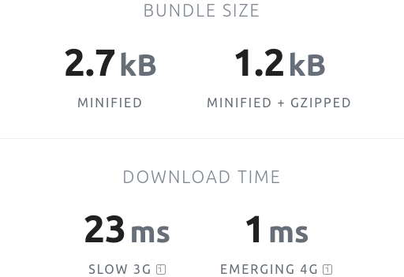
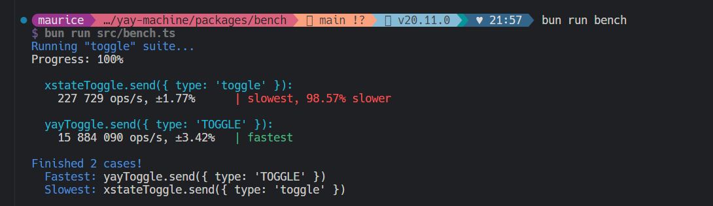

## Modern

**yay-machine** borrows the best ideas from other JS/TypeScript state-machine and state-management libraries.

It will feel familiar to **XState** users, with features including:

- JSON config
- state-data (context / extended-state / dynamic state)
- conditional transitions (guards)
- immediate (always) transitions
- event handling in specific-state or *any-state*
- similar creation and lifecycle API

And **yay-machine** brings new ideas of its own:

- **states are types** (think: `interface`). They are an `object` with a `name` and any associated data. Different states may have different associated data
- **side-effects** are all you need for sync/async interactions with the current machine and outside world

We prefer contemporary accessible language, to traditional academic terms.

## Simple

**yay-machine** has only a handful of concepts and the API is minimal

- states
- events
- transitions
- side-effects

These features can be combined to model just about anything.

It should be quick to learn, and have a minimal ongoing cost-of-ownership.

## Lightweight

**yay-machine** is [a tiny package](https://bundlephobia.com/package/yay-machine@1.3.2) and won't bloat your app bundles.

Minimal implementation means minimal overhead and you can trust **yay-machine** with your high-performance workloads.

## Zero-dependency

The core **yay-machine** state-machine library has **zero production dependencies**.

It won't bloat your `node_modules/` and you won't have to worry about having to patch some security vulnerability or compatibility issue in a 3rd-party package that **yay-machine** depends on.

## TypeScript

We ❤️ TypeScript and want the best experience for TypeScript developers with state-machines.

Each [**state** in **yay-machine**](./reference/state/) is a type, giving you more compile-time confidence.

## Where next?

import { LinkButton, Card, CardGrid } from '@astrojs/starlight/components';

<CardGrid>
  <Card title="Quick start" icon="rocket">Get up and running fast [with the quick start](/quick-start/)</Card>
  <Card title="Examples" icon="puzzle">Checkout out our [various examples](/examples/toggle/) to demonstrate solving problems with with **yay-machine**</Card>
  <Card title="Reference docs" icon="open-book">Get detailed explanations of concepts and application in the [reference docs](/reference/state/)</Card>
  <Card title="Articles" icon="pen">
    If you're new to state-machines, [read our introduction](./articles/why-state-machines/). 
    If you already have some experience, learn [why **yay-machine** exists](./articles/why-yay-machine/), 
    and see the [comparison with **XState**](./articles/vs-xstate/)
  </Card>
</CardGrid>