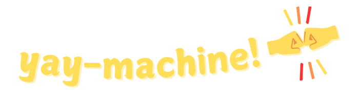

<p align="center">
  <a href="https://github.com/maurice/yay-machine"></a>
</p>

[**yay-machine** is a modern, simple, lightweight, zero-dependency, TypeScript state-machine library for the browser and server.](../../docs/about.md)

This package is the core state-machine library.

# Example

## Define the machine at compile-time

```typescript
import { type CallbackParams, defineMachine } from 'yay-machine';

interface GuessState {
  readonly name: "init" | "playing" | "guessedCorrectly" | "tooManyIncorrectGuesses";
  readonly answer: number;
  readonly numGuesses: number;
  readonly maxGuesses: number;
}

interface GuessEvent {
  readonly type: "GUESS";
  readonly guess: number;
}

interface NewGameEvent {
  readonly type: "NEW_GAME";
}

const incrementNumGuesses = ({ state }: CallbackParams<GuessState, GuessEvent>): GuessState => ({
  ...state,
  numGuesses: state.numGuesses + 1,
});

/**
 * Guess a number from 1 to 10
 */
export const guessMachine = defineMachine<GuessState, GuessEvent | NewGameEvent>({
  initialState: { name: "init", answer: 0, numGuesses: 0, maxGuesses: 5 },
  states: {
    init: {
      always: {
        to: "playing",
        data: ({ state }) => ({ ...state, answer: Math.ceil(Math.random() * 10), numGuesses: 0 }),
      },
    },
    playing: {
      on: {
        GUESS: [
          {
            to: "tooManyIncorrectGuesses",
            when: ({ state }) => state.numGuesses + 1 === state.maxGuesses,
            data: incrementNumGuesses,
          },
          {
            to: "guessedCorrectly",
            when: ({ state, event }) => state.answer === event.guess,
            data: incrementNumGuesses,
          },
          {
            to: "playing",
            data: incrementNumGuesses,
          },
        ],
      },
    },
  },
  on: {
    NEW_GAME: { to: "init" },
  },
});
```

## Create instances and operate them at run-time

```typescript
const guess = guessMachine.newInstance().start();

for (let i = 0; guess.state.name === "playing"; i++) {
  guess.send({ type: "GUESS", guess: i + 1 });
}

if (guess.state.name === "guessedCorrectly") {
  console.log("yay, we won :)");
}
if (guess.state.name === "tooManyIncorrectGuesses") {
  console.log("boo, we lost :(");
}
```

# Next...

* [About **yay-machine**](../../docs/about.md)
* [Quick Start](../../docs/quick-start.md)
* [Reference docs](../../docs/reference/readme.md)
* [Why state-machines?](../../docs/articles/why-state-machines.md)
* [Why **yay-machine**?](../../docs/articles/why-yay-machine.md)
* [**yay-machine** vs **XState**?](../../docs/articles/vs-xstate.md)
